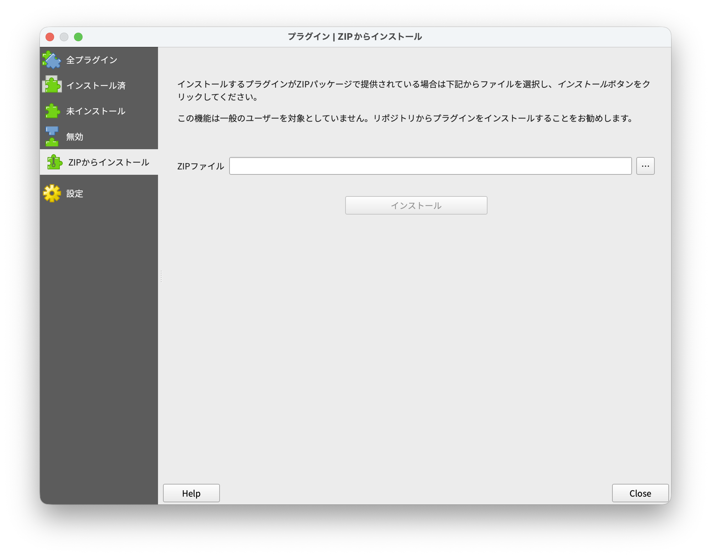
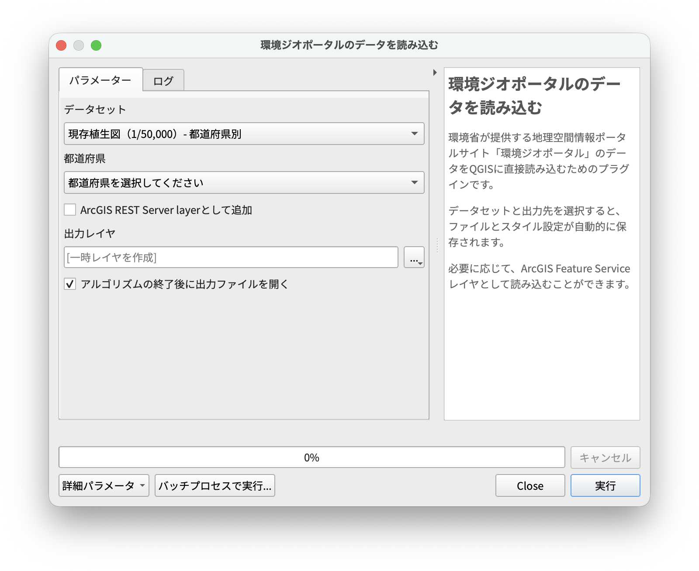

# MOE Geoportal Loader

## 概要

- 環境省が運営する地理空間情報ポータルサイト「[環境ジオポータル](https://geoportal.env.go.jp)」で公開されているデータのうち、タイプが「Feature Service」で、ライセンスが「CC BY 4.0」のものを QGIS に直接読み込めるプラグインです。

## インストール

- [Releases](https://github.com/Geo-Jagaimo/qgis-plugin-moe-geoportal-loader/releases) ページから最新の「moe-geoportal-loader」パッケージをダウンロードします。
- QGIS の［プラグインの管理とインストール...］で［ZIP からインストール］を選択し、ダウンロードした ZIP ファイルを解凍せずにそのまま指定してインストールしてください。

## 使用方法

- 適当に使って〜

## Authors

- [Keita Uemori](@Geo-Jagaimo)
