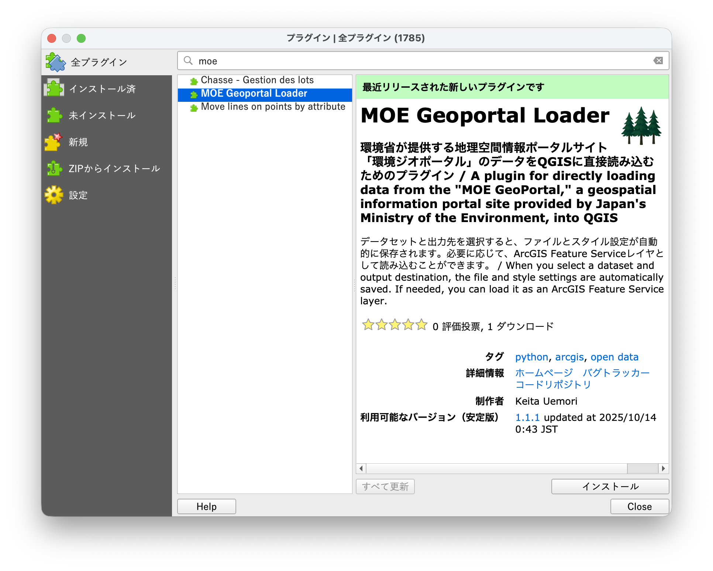

# MOE Geoportal Loader

## 概要

- 環境省が運営する地理空間情報ポータルサイト「[環境ジオポータル](https://geoportal.env.go.jp)」で公開されているデータのうち、タイプが「Feature Service」で、ライセンスが「CC BY 4.0」のものを QGIS に直接読み込めるプラグインです。
- [QGIS Pyton Plugins Repository](https://plugins.qgis.org/plugins/moe_geoportal_loader)に登録されているため、QGIS プラグインマネージャから直接インストールできます。

## インストール

- QGIS を起動し、メニューバーより［プラグイン］→［プラグインの管理とインストール...］の順にクリックします。
- プラグインマネージャが起動するため、［全プラグイン］タブで「moe」と検索します。
- 「MOE Geoportal Loader」を選択し、［インストール］ボタンよりインストールできます。
- インストールが完了したら、［インストール済み］タブで「MOE Geoportal Loader」にチェックが入っていることを確認し、プラグインマネージャを閉じます。

## 使用方法

- プラグインは、プロセシングツールボックスに追加されます。
- 読み込みアルゴリズムはデータセットごとに分かれています。「MOE Geoportal Loader」トグルを展開して、利用したいデータセットを選択してください。

- データセットと出力先を選択すると、ファイルとスタイル設定が自動的に保存されます。
- 必要に応じて、ArcGIS Feature Service レイヤとして読み込むことができます。
- 「現存植生図 2024」は非常に大きなデータセットです。利用の際は、処理負荷や動作環境にご注意ください。

## Authors

- [Keita Uemori](@Geo-Jagaimo)
