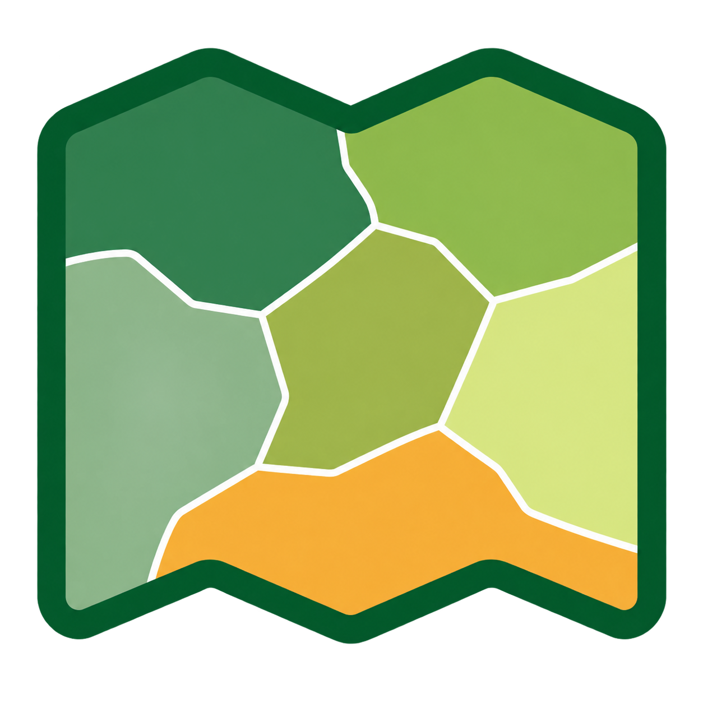

# MOE Geoportal Loader

## Overview

- This plugin allows you to directly load datasets published on [MOE GeoPortal](https://geoportal.env.go.jp/), a geospatial information portal operated by Japan's Ministry of the Environment, into QGIS.
- It targets datasets with the type "Feature Service" and licensed under CC BY 4.0.

## Features

- Load environmental datasets directly from MOE GeoPortal into QGIS.
- Automatic file and style saving when selecting a dataset and output destination.
- Optional loading as ArcGIS Feature Service layers.
- Integrated into the QGIS Processing Toolbox.

## Datasets

#### Vegetation Maps（10 datasets）

| Dataset                                    | Details                                                                     |
| ------------------------------------------ | --------------------------------------------------------------------------- |
| Existing Vegetation Map（1:50,000）        | by prefecture                                                               |
| Existing Vegetation Map 2024               | Hokkaido, Tohoku, Kanto, Hokuriku, Chubu, Kinki, Chushikoku, Kyushu-Okinawa |
| Northern Territory Vegetation Overview Map |                                                                             |

#### Mammal Distribution Surveys（4 datasets）

| Dataset                                 | Details                  |
| --------------------------------------- | ------------------------ |
| Medium/Large Mammal Distribution Survey | Badger, Fox, Raccoon Dog |
| National Bear Distribution Mesh         | Basic Survey 1980        |

#### Coral Reef Ecosystem Surveys（3 datasets）

| Dataset                       | Details                                                                 |
| ----------------------------- | ----------------------------------------------------------------------- |
| 4th Coral Survey（1988–1993） | Small-scale Ogasawara Coral Reef Area, Non-Coral Reef Distribution Area |
| 5th Coral Survey（1993–1999） | Distribution Area                                                       |

#### Seaweed Bed Surveys（2 datasets）

| Dataset                             | Details |
| ----------------------------------- | ------- |
| 4th Seaweed Bed Survey（1988–1993） |         |
| 5th Seaweed Bed Survey（1993–1999） |         |

## Requirements

- QGIS 3.44 or later

## License

- This plugin is licensed under the [GNU General Public License v2.0](LICENSE).
- The datasets loaded by this plugin are provided by MOE GeoPortal under [CC BY 4.0](https://creativecommons.org/licenses/by/4.0/).

## Authors

- [Keita Uemori](https://github.com/Geo-Jagaimo)
